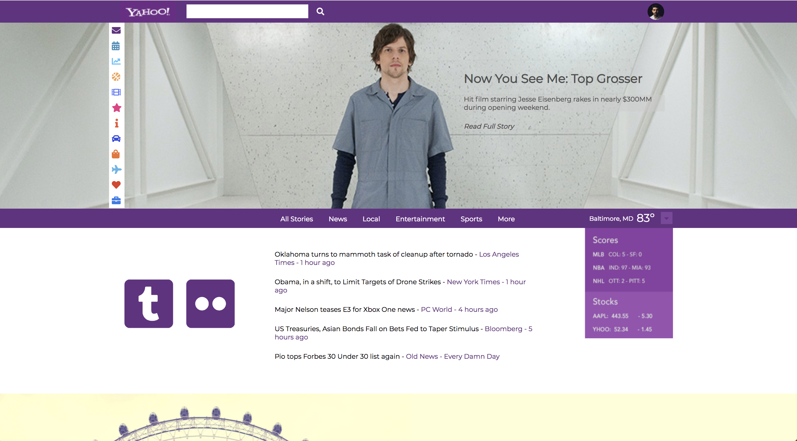

# HTML-CSS-Recreation

My first weekend project at Wyncode Academy in Miami, FL.

We had to recreate assigned images using HTML and CSS only.

# Original

# Remake using HTML & CSS

1                                                                |  2
:---------------------------------------------------------------:|:-------------------------:
 | 

